# Crude Blend Optimizer — ML Surrogate + Differential Evolution at Refinery Scale

[](https://github.com/batestguy/dangote-refinery-optimizer/actions/workflows/ci.yml)
[](https://batestguy.github.io/dangote-refinery-optimizer/)


[](LICENSE)

Choose the **crude diet** and **FCC severity** that maximize margin for a
650,000 bbl/day refinery. The plant is sized like the Dangote Refinery in
Lekki, Nigeria. The project runs end to end on free, public data: published
crude assays go through a cited refinery model to product yields, then to a
machine-learning surrogate, then to an optimizer. The optimizer is checked
against an exact linear-program optimum and stress-tested on 10,000
correlated price scenarios.

> **Methodology demo on public data only.** Not affiliated with Dangote
> Industries. No proprietary or plant data is used, and nothing here describes
> the refinery's actual operations. Every number is either integrated from a
> published curve, cited to a source, or labeled **ASSUMED / PLACEHOLDER**
> with a reason and a way to refresh it.

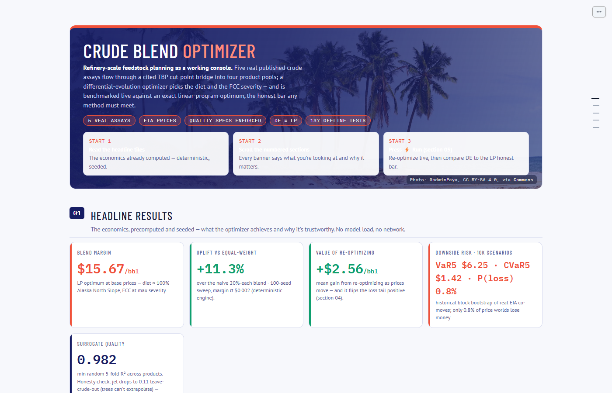

---

## Contents

1. [Live demo](#live-demo)
2. [Headline results](#headline-results)
3. [Dashboard tour](#dashboard-tour)
4. [Methodology](#methodology)
   - [4.1 The decision problem](#41-the-decision-problem)
   - [4.2 Data: what is real and what is assumed](#42-data-what-is-real-and-what-is-assumed)
   - [4.3 From assay to yields: the TBP bridge](#43-from-assay-to-yields-the-tbp-bridge)
   - [4.4 Product quality constraints](#44-product-quality-constraints)
   - [4.5 The ML surrogate (Extra Trees)](#45-the-ml-surrogate-extra-trees)
   - [4.6 Optimization: differential evolution and its baselines](#46-optimization-differential-evolution-and-its-baselines)
   - [4.7 Scenario risk: 10,000 correlated price worlds](#47-scenario-risk-10000-correlated-price-worlds)
   - [4.8 Limitations and scope](#48-limitations-and-scope)
5. [Architecture](#architecture)
6. [Reproduce it](#reproduce-it)
7. [Deployment](#deployment)
8. [Engineering practices](#engineering-practices)
9. [Documentation index](#documentation-index)
10. [Credits and license](#credits-and-license)

---

## Live demo

**▶ https://batestguy.github.io/dangote-refinery-optimizer/**

> ⏳ **Heads-up: the first visit can take up to ~5 minutes to set up.**
> Your browser downloads a full scientific Python stack (~50–100 MB),
> and it's slower on mobile data. Keep the tab open; later visits load
> from cache. If you see "Something went wrong" or a "please reload"
> message, reload the page (in Brave, turn Shields off for the site).
> For an instant view, see the screenshots below or run it locally.

The dashboard is a [marimo](https://marimo.io) notebook compiled to
WebAssembly. Python runs **inside your browser** (via Pyodide), so there is no
server to wake up and nothing leaves your machine. The trade-off is the first
visit: the browser downloads Python plus NumPy, pandas, SciPy and
scikit-learn, which can take **up to ~5 minutes**, depending on your connection.
Later visits load from the browser cache.

After it loads, scroll to **section 05** and press **⚡ Run deep
optimization**. The optimizer runs live in your browser in a few seconds.

To run it locally instead (it loads instantly):

```bash
uv sync
uv run marimo run app/app.py
```

---

## Headline results

| Question | Answer |
|---|---|
| Best crude diet at base prices | **~100% Alaska North Slope, FCC at maximum severity.** Its sour-crude discount is bigger than the cost of meeting the sulfur and quality specs. |
| Margin at the optimum | **$15.67/bbl**: the exact LP optimum, which differential evolution matches to within **$0.005/bbl** |
| Uplift vs a naive equal-weight blend | **+10.0%** on the exact physics ($15.67 vs $14.23/bbl). **+11.3%** through the ML surrogate (100-seed sweep); the gap is the surrogate's disclosed ≈1% model error. |
| Is the optimizer finding the true optimum? | **Yes.** The yield physics are linear in the decision variables, so the LP is exact, and DE matches it. |
| Surrogate accuracy | Random 5-fold R² **≥ 0.982** on all four products. Leave-one-crude-out is reported alongside and explained. |
| Value of re-optimizing as prices move | **+$2.56/bbl** on average, and it turns the worst-5% tail from **−$3.50 into +$1.42** (CVaR 5%) |
| Downside risk (10k correlated scenarios) | VaR 5% **$6.25** · CVaR 5% **$1.42** · P(loss) **0.8%** |
| Does the best diet change with prices? | Yes, between two regimes: ANS is optimal in **50.5%** of scenarios and Forcados in **47.9%** |
| Runtime | DE ≈ **0.85 s** on the exact model, ≈ 3.4 s through the surrogate. The 10k-scenario Monte Carlo takes ≈ 85–105 s. |
| Reproducibility | Seeded throughout (`20260919`). The 100-seed DE sweep has margin σ = **$0.0015/bbl**. 137 offline tests run in CI on every push. |

---

## Dashboard tour

The page reads top to bottom as numbered sections. Each one says what you are
looking at and why it matters.

### Hero: what this is

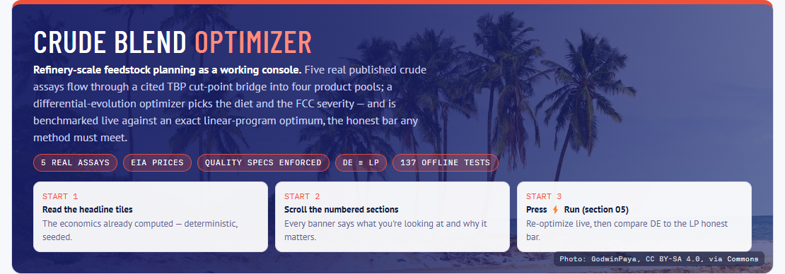

The one-paragraph pitch, trust badges (real assays, EIA prices, quality specs
enforced, DE ≡ LP, offline tests), and a three-step "how to read this page".
The photo is the Dangote site at Lekki, credited under CC BY-SA 4.0.

### 01 · Headline results

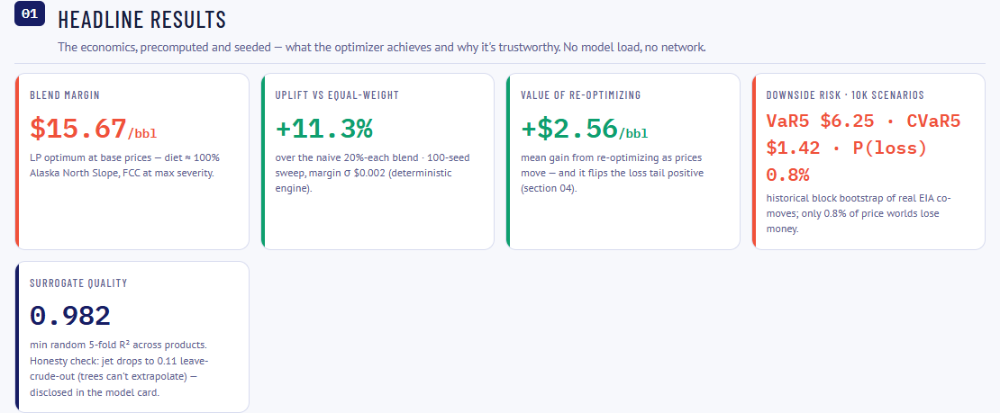

Precomputed, seeded results that need no model load and no network: blend
margin, uplift vs equal weight, value of re-optimizing, downside risk, and
surrogate quality. The surrogate tile shows its weak spot too: jet R² drops to
0.11 when a whole crude is held out (see [4.5](#45-the-ml-surrogate-extra-trees)).

### 02 · Live market tape

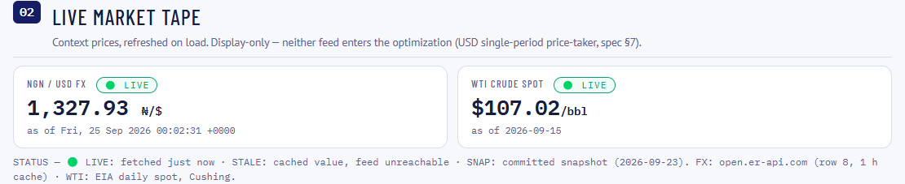

NGN/USD exchange rate (open.er-api.com) and WTI spot (EIA daily, Cushing),
fetched on load. Each quote has a status badge: **LIVE** (fetched just now),
**STALE** (cached value, feed unreachable) or **SNAP** (committed snapshot).
These are **context only**. Neither feed enters the optimization, because the
model is a single-period USD price-taker.

### 03 · What the optimizer chose

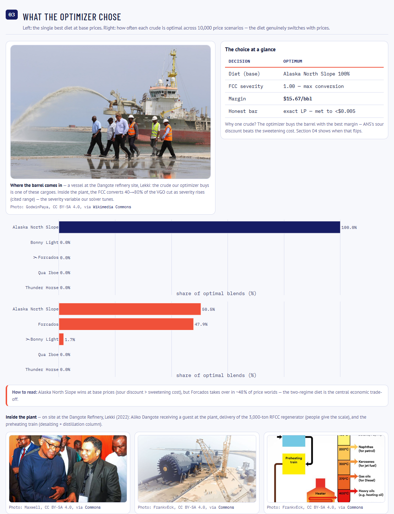

Left: the single best diet at base prices, a summary table and the diet bar
chart. Right: **how often each crude is optimal across 10,000 price
scenarios**. The diet really does switch between Alaska North Slope and
Forcados as crack spreads move, and that two-regime result is the central
economic trade-off. Below the charts, credited photos of the plant give the
physical context.

### 04 · Risk: 10,000 correlated scenarios

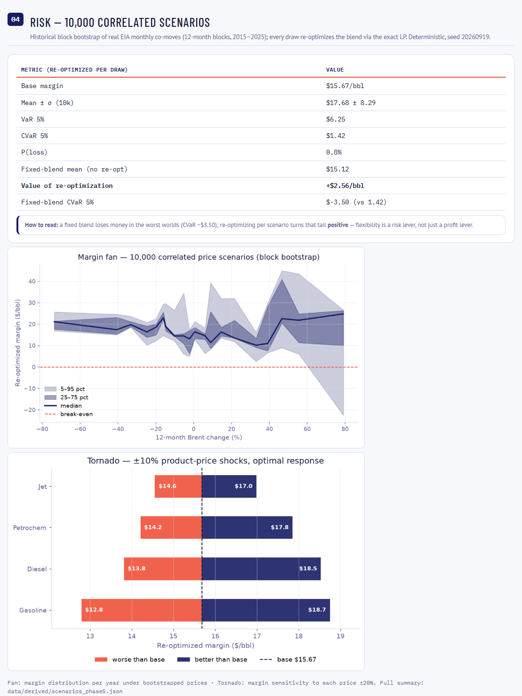

- **Table:** VaR, CVaR and probability of loss, with every scenario
  re-optimized, compared against a *fixed* blend under the same scenarios.
- **Margin fan:** the re-optimized margin distribution against the 12-month
  Brent change.
- **Tornado (interactive):** hover or tap a bar for exact values. It shows
  margin sensitivity to ±10% shocks in each product price, with
  the blend re-optimized each time. Gasoline moves margin most, diesel second.

### 05 · Deep re-optimization, live

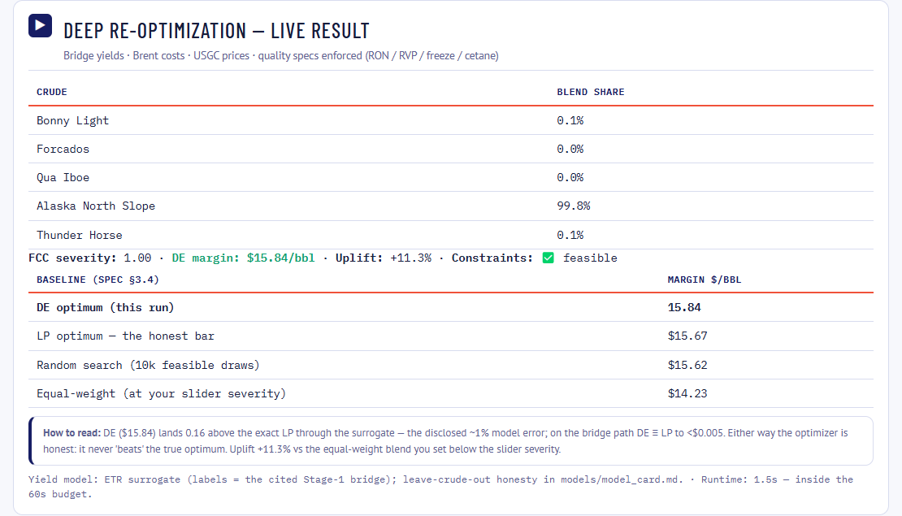

Press **Run** and the app runs differential evolution live under the full
constraint set: blend API and sulfur windows, RON, RVP, jet freeze point and
diesel cetane. It prints the result next to the **mandatory baselines**: the
exact LP optimum (the honest bar), random search over 10k feasible blends, and
the equal-weight blend at the severity you chose on the slider.

The screenshot is from a local run *through the ML surrogate*. That run lands
$0.16 above the exact LP, which is the surrogate's ≈1% model error, and the
page says so. The browser demo uses the exact bridge model, where DE matches
the LP ($15.67). Either way the page never claims to beat the true optimum.

### 06 · Transparency

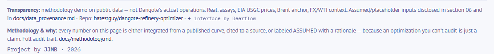

Which inputs are real, which are assumed, and where the audit trail lives.

---

## Methodology

This section explains the whole modeling chain. The full audit trail, with a
citation for every constant, is in
[`docs/methodology.md`](docs/methodology.md). Source-by-source data
verification is in [`docs/data_provenance.md`](docs/data_provenance.md).

### 4.1 The decision problem

**Decision variables:**

- `x_j ≥ 0` with `Σ x_j = 1`: the blend share of each crude in a 5-crude slate.
- `s ∈ [0, 1]`: FCC severity, a **normalized conversion proxy**. It is not a
  reactor temperature, because no plant data is claimed.

**Objective:** margin per blended barrel:

```
maximize   M(x, s) = Σᵢ yieldᵢ(x, s) · priceᵢ  −  Σⱼ xⱼ · costⱼ
            i ∈ {gasoline, diesel, jet, petrochem}
```

**Constraints:**

| Constraint | Form |
|---|---|
| Blend API gravity window | `30 ≤ Σ xⱼ·APIⱼ ≤ 45` |
| Blend sulfur cap | `Σ xⱼ·Sⱼ ≤ 1.5 wt%` |
| Gasoline research octane (RON) | blend index ≥ 91 |
| Gasoline vapor pressure (RVP) | RVP index ≤ 60 kPa |
| Jet freeze point | ≤ −47 °C |
| Diesel cetane index | ≥ 45 |
| Severity | `0 ≤ s ≤ 1` |

**Success gates, set before any modeling:**

| Metric | Viable | Impressive | Result |
|---|---|---|---|
| Surrogate R² (random 5-fold) | > 0.80 | > 0.90 | **0.982** ✅ |
| Surrogate R² (leave-crude-out) | reported | gap quantified and explained | ✅ (see 4.5) |
| Margin uplift vs equal-weight | > 5% | > 10% | **+10.0%** on the exact model ✅ |
| DE vs exact LP | reported | explained mechanistically | DE ≡ LP, and the reason is shown ✅ |

### 4.2 Data: what is real and what is assumed

| Layer | Source | Status |
|---|---|---|
| **Crude slate** | Published assays from TotalEnergies (Bonny Light, Forcados) and ExxonMobil (Qua Iboe, Alaska North Slope, Thunder Horse): API gravity, sulfur, full TBP distillation curve | ✅ Real. Parsed from vendor PDFs and validated |
| **Product prices** | EIA US Gulf Coast spot, 12-month averages: gasoline $84.77, diesel $93.49, jet $88.94 per bbl | ✅ Real |
| **Crude costs** | EIA Brent trailing 12-month average ($69.10/bbl) plus a per-grade differential | Brent ✅ real · differentials **ASSUMED** from crude quality (lighter/sweeter = premium, sour = discount). Refresh path: OPEC MOMR monthly actuals |
| **Petrochem pool price** | LPG / propylene / residue basket | **PLACEHOLDER**, disclosed. No citable free spot series exists |
| **Scenario shocks** | EIA monthly price changes, 2015–2025 (Brent and the three products together) | ✅ Real |
| **Quality data** | Published cut qualities from the TotalEnergies sheets; mid-range values for the ExxonMobil crudes | Published where available, **ASSUMED** otherwise, with a reason for each |
| **Market tape** | open.er-api.com FX and EIA WTI daily | ✅ Real, display only |

**The slate:**

| Crude | Origin | API | Sulfur wt% | Assay source |
|---|---|---|---|---|
| Bonny Light | Nigeria | 34.9 | 0.15 | TotalEnergies (2020) |
| Forcados | Nigeria | 31.5 | 0.22 | TotalEnergies (2014) |
| Qua Iboe | Nigeria | 37.3 | 0.12 | ExxonMobil |
| Alaska North Slope | USA | 32.3 | 1.04 | ExxonMobil |
| Thunder Horse | US Gulf | 34.5 | 0.76 | ExxonMobil |

The original candidates Arab Light and Urals were replaced. Neither has an
openly published TBP assay: Saudi Aramco's sheets are gated, and Urals isn't
in any open library. The two US grades are the documented substitutes.

### 4.3 From assay to yields: the TBP bridge

A crude assay says *what's in the barrel*. The optimizer needs *what the
refinery makes from it*. The **bridge** (`features/bridge.py`) turns one into
the other with an explicit mass balance in which every constant is cited.

**Step 1: cut the TBP curve.** The true-boiling-point curve is integrated
between standard cut points:

| Cut | Boiling range | Goes to |
|---|---|---|
| Straight-run naphtha | < 180 °C | gasoline pool (via octane units) |
| Kerosene | 180–260 °C | jet pool |
| Distillate | 260–360 °C | diesel pool |
| Vacuum gas oil (VGO) | 360–540 °C | **FCC unit** |
| Residue | > 540 °C | petrochem / fuel pool |

**Step 2: the FCC unit, where severity acts.** FCC conversion of the VGO
rises **linearly from 40% to 80%** with severity. That window comes from
Gary & Handwerk's range for typical VGO FCC operation. Converted VGO splits
**50% gasoline / 18% light cycle oil (diesel range) / 32% light gas and
coke**. Unconverted VGO (slurry) goes to the heavy pool.

**Step 3: octane units.** Straight-run naphtha blends at only about RON 58,
while the spec is 91. Without octane units no blend is feasible, so the bridge
includes them:

| Unit | Feed | Yield | Basis |
|---|---|---|---|
| Isomerization | light naphtha (< 80 °C) | ≈100% isomerate | Gary & Handwerk ch. 8 |
| Reforming | mid naphtha (80–180 °C) | 85% reformate (rest is LPG + H₂) | midpoint of the 80–88% range, ch. 9 |
| Alkylation | FCC C₃/C₄ | 50% of the gas lump becomes alkylate | conservative share, ch. 7 |
| Butane pull | light naphtha front end | 25% to LPG | RVP control, ASSUMED |

**Step 4: treating.** Hydrotreating costs about 1 vol% of diesel yield (ICCT
refining tutorial, exhibit 17).

**Step 5: pooling.** The streams sum into four product pools:

| Pool | Streams |
|---|---|
| Gasoline | isomerate + reformate + FCC gasoline + alkylate |
| Diesel | straight-run distillate + FCC light cycle oil, minus the treating loss |
| Jet | straight-run kerosene |
| Petrochem | residue + slurry + non-alkylated FCC gas + reformer LPG + butane |

**Validation.** Before building any model on top, the parser and integrator
were checked against the Bonny Light assay's own published cut-yield table.
Interior cuts match to **±0.2 vol%**:

| Cut | From the parsed curve | Published | Δ |
|---|---|---|---|
| Naphtha 80–150 °C | 14.3 | 14.5 | −0.2 |
| Naphtha 80–175 °C | 19.4 | 19.5 | −0.1 |
| Kerosene 150–230 °C | 15.3 | 15.1 | +0.2 |
| Kerosene 150–250 °C | 20.0 | 19.8 | +0.2 |
| Gasoil 175–400 °C | 49.0 | 49.0 | 0.0 |
| Gasoil 230–375 °C | 34.6 | 34.7 | −0.1 |

The only larger gap is the lightest cut. The vendor's TBP table counts about
2 vol% of dissolved C₂–C₄ gas in its first row, and that simplification is
documented.

**A key structural fact.** Every stream is **affine in severity** for a fixed
blend: `stream(x, s) = x·A + s·x·B`. That's because FCC conversion is linear
in `s` and every other step takes a fixed fraction of the cut volumes. This
drives the optimization design in 4.6.

### 4.4 Product quality constraints

Pool qualities are computed from the same component streams as the yields
(`features/quality.py`: one mass balance feeding two consumers). The blending
rules follow standard LP practice:

| Property | Blending rule | Reference |
|---|---|---|
| Gasoline RON | linear by volume | Gary & Handwerk ch. 10 |
| Gasoline RVP | **RVP^1.25 index**, blended linearly, then inverted | Haverly Systems, "Blending by Index" |
| Jet freeze point | linear by volume | standard single-pool practice |
| Diesel cetane index | linear by volume | ASTM D4737 values from the assay sheets |

Octane-unit outputs carry fixed qualities: reformate RON 98, FCC gasoline 93,
alkylate 93, isomerate at the crude's light-naphtha RON + 4, and light cycle
oil at cetane 22. Crude-specific qualities come from the assay sheets where
they are published.

The constraints bind: **RON and cetane are nearly active at the optimum**, so
the diet choice is doing real work rather than sitting behind specs that never
bind.

### 4.5 The ML surrogate (Extra Trees)

An **Extremely Randomized Trees** regressor (`models/`) learns the bridge.
It inherits the bridge's physics and adds none of its own.

- **Features:** blend-weighted crude properties (API, sulfur) + blend-weighted
  TBP cut fractions + severity.
- **Labels:** the bridge's four pool yields. They are generated and cited, and
  none is claimed to be plant data.
- **Training set:** 4,000 blends sampled from Dirichlet(α = 0.55) on the
  simplex × Uniform(0, 1) severity, seed 20260919.
- **Model:** 150 trees, depth 14, min leaf 4. With 300 trees accuracy was the
  same but the file grew to 96.5 MB, over the 50 MB hosting limit.

**Two cross-validations, always reported together:**

| Target | Random 5-fold R² | Leave-one-crude-out R² |
|---|---|---|
| Gasoline | 0.989 | 0.935 |
| Diesel | 0.997 | 0.781 |
| Jet | 0.982 | **0.114** |
| Petrochem | 0.998 | 0.969 |

Random 5-fold tests *interpolation*, which is how the optimizer uses the
model. Leave-crude-out tests *a crude it has never seen*.

The low jet score is a finding, not a bug. When Alaska North Slope is held out
(12.6% kerosene, against 14–17% for the other crudes), the test rows fall
below anything in the training range, and tree ensembles cannot extrapolate.
In deployment the optimizer only blends crudes the model was trained on, so
this situation never arises. The number bounds what would happen if a
genuinely new crude were added.

**Fidelity:** inside the training envelope the surrogate's yields differ from
the bridge by at most ≈ 0.0007, and it picks the same optimal blend.
Permutation importance ranks severity as the main driver of gasoline and
petrochem, and the distillate cut as the main driver of diesel. Full details
are in [`models/model_card.md`](models/model_card.md).

### 4.6 Optimization: differential evolution and its baselines

**Differential evolution** (SciPy, `optimization/de_driver.py`) searches over
`(x, s)`:

- **Simplex repair:** blend shares are renormalized so `Σx = 1`.
- **Constraint penalty:** a linear + quadratic penalty for any violation, so
  an infeasible blend can never outscore a feasible one. Reported margins are
  always the *unpenalized* value, with feasibility shown separately.
- **Vectorized:** the whole DE population is evaluated in one NumPy pass. The
  batch path is pinned to the scalar path at machine precision by tests. That
  brought a run from ~127 s down to **0.85 s** on the bridge (~3.4 s through
  the surrogate).

**Mandatory baselines.** The DE result is never reported alone:

1. **Equal-weight** blend (20% each) at the chosen severity: what a planner
   gets without optimizing.
2. **Random search:** the best of 10,000 feasible random blends.
3. **Exact LP optimum**, the honest bar.

**Why the LP is exact, not an approximation.** Every stream is affine in
severity (4.3), so substituting `u_j = s·x_j` makes the whole problem linear in
10 variables with `0 ≤ u_j ≤ x_j`. The quality specs become hard linear
constraints: RON and the RVP index are ratios of linear sums, so they are
cross-multiplied. Those constraints are built from **the same coefficients**
as the DE penalty, so the two formulations can't drift apart.

**Result:** DE matches the exact LP to **< $0.005/bbl**. The honest conclusion
is that on this physics no method can beat the LP, and DE proves it finds the
true optimum. If future versions add nonlinear blending or crude-specific FCC
splits, the same comparison will show whether DE pulls ahead.

**Robustness:** a 100-seed sweep gives margin σ = $0.0015/bbl.

| Convergence | Seed sensitivity |
|---|---|
| 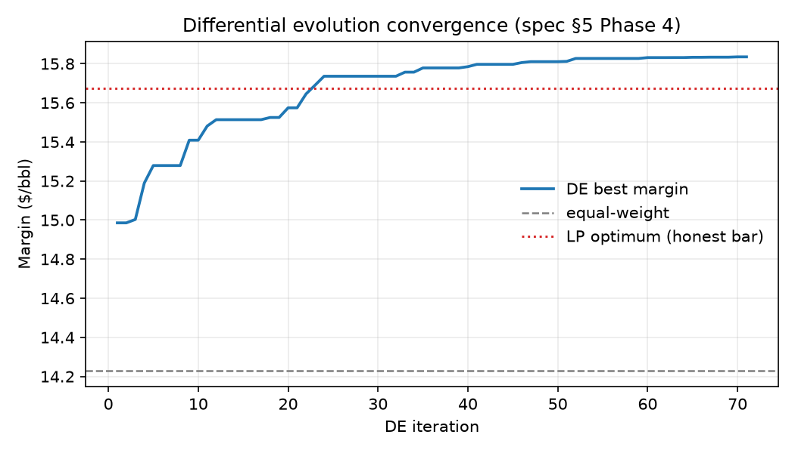 | 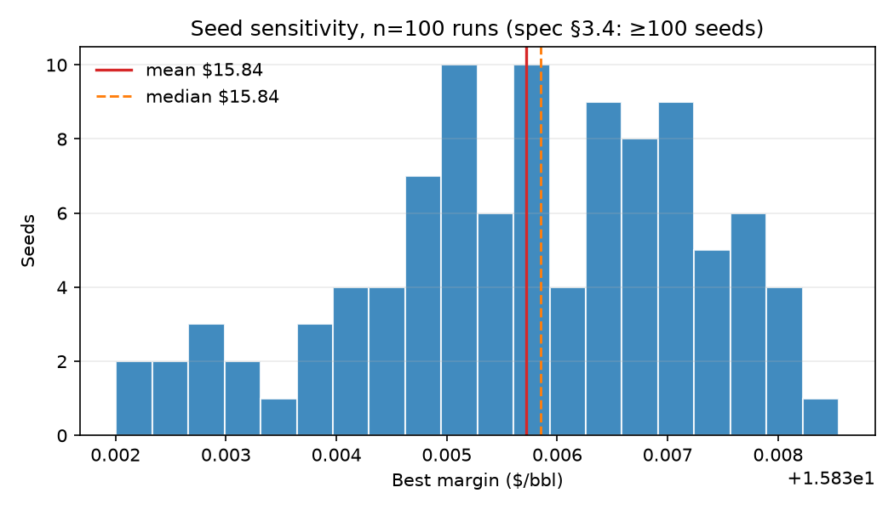 |

### 4.7 Scenario risk: 10,000 correlated price worlds

`optimization/scenarios.py` asks how the plan holds up when prices move.

- **Shock distribution:** a *historical block bootstrap*. Each scenario sums
  12 consecutive months of real EIA monthly log-price changes (2015–2025) for
  Brent, gasoline, diesel and jet **jointly**. The blocks keep seasonality and
  autocorrelation. Joint sampling keeps the real correlation between crude and
  product prices (crack-spread dynamics). Independent shocks would understate
  tail risk.
- **Re-optimizing in every scenario:** each of the 10,000 scenarios re-solves
  the exact LP. That is the planner's best response to that market.
- **Cost linkage:** a Brent shock shifts every crude's cost by the same amount.
  Because the blend shares sum to 1, that shift cancels out of the LP's choice
  of blend. It is subtracted from the margin afterwards, so per-grade
  differentials are preserved.

**Results (seed 20260919):**

| Metric | Re-optimized per scenario | Fixed base blend |
|---|---|---|
| Mean margin | **$17.68** ± 8.29 | $15.12 |
| VaR 5% | $6.25 | $4.06 |
| CVaR 5% (mean of worst 5%) | **+$1.42** | **−$3.50** |
| P(loss) | 0.8% | — |

The takeaway: **re-optimizing is a risk lever, not just a profit lever.** It
adds $2.56/bbl on average *and* turns a money-losing tail into a positive one.
The optimal diet switches between two regimes (ANS 50.5%, Forcados 47.9%,
Bonny Light 1.7%) depending on the shape of the crack spreads.

| Margin fan | Tornado (±10% price shocks) |
|---|---|
| 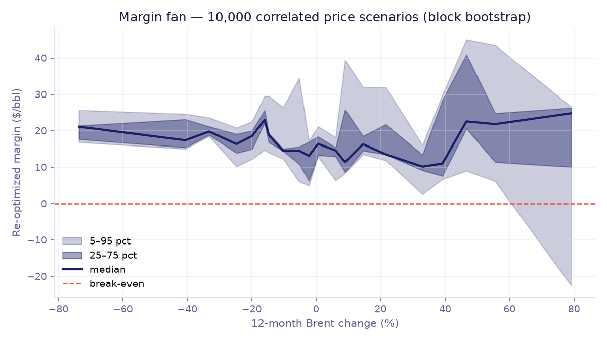 | 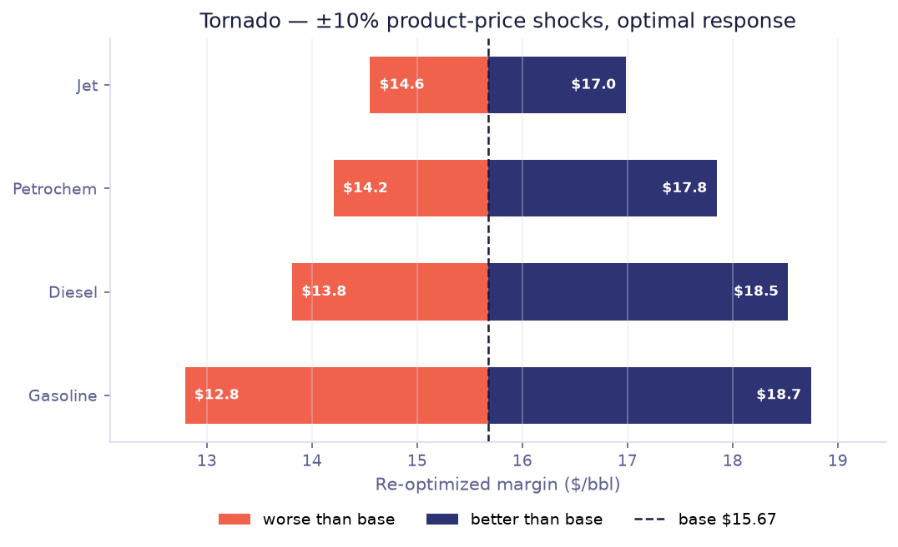 |

### 4.8 Limitations and scope

These simplifications are deliberate, and each is documented along with the
refinement that would remove it:

- **Constant FCC product split across crudes.** Real splits vary with feed
  paraffinicity (Watson K). The Maples correlations would capture this, but
  they are not openly reproducible, so they were rejected for traceability.
- **Linear severity response.** Real FCC conversion response is mildly
  S-shaped.
- **No per-cut density correction** between volume and weight bases.
- **Jet has no severity response**, because kerosene is straight-run only.
- **ASSUMED crude differentials and a PLACEHOLDER petrochem price.** Both are
  disclosed in the app and in the provenance table.
- **Single period, USD price-taker.** No FX or demand-feedback channel, no
  inventory, no unit-level temperature or catalyst tuning (that needs plant
  data).
- **No FCC plant calibration.** The open MIT FCCU dataset was checked and
  rejected: it is fault-detection data with no severity sweep.

---

## Architecture

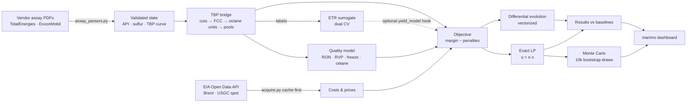

```
src/dangote_opt/
  config.py            all locked constants: specs, penalties, DE budget
  data/                EIA client · assay parsers · costs · prices · FX/WTI ticker
  features/            blend.py (linear rules) · bridge.py (TBP → yields, exact batch path)
                       quality.py (RON/RVP/freeze/cetane + exact batch mirror)
  models/              dataset.py (bridge-label sampler) · train_surrogate.py (ETR + dual CV)
  optimization/        objective.py · de_driver.py (vectorized DE) · baselines.py (exact LP)
                       scenarios.py (bootstrap Monte Carlo, VaR/CVaR, tornado)
  viz/                 convergence and sensitivity figures
app/app.py             the marimo dashboard (same file runs locally, on a server, or in the browser)
app/public/            data, figures, photos and the package wheel for the in-browser build
scripts/               build_slate · build_costs · build_prices · train_surrogate ·
                       sensitivity_study · run_scenarios · build_space_root
tests/                 137 offline tests
data/derived/          committed artifacts: everything runs offline from these
```

The objective takes four injectable hooks (`yield_model`, `quality_model`,
`batch_yields`, `batch_quality`), so the bridge and the surrogate plug into
the same optimizer.

---

## Reproduce it

Everything is free tooling. [uv](https://docs.astral.sh/uv/) manages Python
3.12, and `uv.lock` is committed.

```bash
git clone https://github.com/batestguy/dangote-refinery-optimizer.git
cd dangote-refinery-optimizer
uv sync                          # reproducible env from uv.lock
uv run pytest                    # 137 tests, fully offline, ~15–30 s
uv run marimo run app/app.py     # the dashboard at http://localhost:2718
```

Regenerate the artifacts (all deterministic). On Windows, prefix with
`PYTHONUTF8=1`:

```bash
uv run python scripts/train_surrogate.py     # ~5 s  → models/etr_surrogate.pkl + model card
uv run python scripts/sensitivity_study.py   # ~6 min → 100-seed DE sweep, figures + JSON
uv run python scripts/run_scenarios.py       # ~90 s → 10k Monte Carlo, figures + summary
```

The committed files in `data/derived/` make everything run offline. Live
refreshes from EIA are optional and need a free `EIA_API_KEY` in `.env` (see
`.env.example`).

---

## Deployment

One notebook, `app/app.py`, runs in three places:

| Target | How |
|---|---|
| **GitHub Pages (in-browser)** | `marimo export html-wasm`. On startup the notebook installs its own wheel and copies the committed data from `public/` into the browser's filesystem, so the same code runs unchanged. |
| **Local / server** | `marimo run app/app.py`. A Docker kit for Hugging Face Spaces is in `deploy/`, with pins checked against `uv.lock` and secret-free assembly by `scripts/build_space_root.py`. |
| **Cold start** | Every live feed falls back to a committed artifact, and the app runs without the surrogate file by using the exact bridge. |

---

## Engineering practices

- **Traceability rule:** every number is integrated, cited, or labeled
  ASSUMED/PLACEHOLDER. [`docs/methodology.md`](docs/methodology.md) is the
  audit trail.
- **Test before trust:** mass balances, physical invariants, batch ≡ scalar
  equivalence (to machine precision), LP exactness and VaR/CVaR relations are
  all pinned in `tests/`.
- **Two CV protocols, always together:** random k-fold is never reported
  without leave-crude-out.
- **Baselines are mandatory:** the optimizer is always compared with
  equal-weight, random search and the exact LP.
- **CI** runs ruff and the full test suite on every push. **Deterministic
  seeds** are used throughout.

---

## Documentation index

| Document | What's in it |
|---|---|
| [`docs/methodology.md`](docs/methodology.md) | Every constant in the model, with citations |
| [`docs/data_provenance.md`](docs/data_provenance.md) | Source-by-source verification table |
| [`docs/problem_statement.md`](docs/problem_statement.md) | Formulation, locked decisions, success gates |
| [`models/model_card.md`](models/model_card.md) | Surrogate dual-CV results and importances |
| [`docs/executive-summary.md`](docs/executive-summary.md) | One-page summary for decision makers |
| [`docs/blog-post.md`](docs/blog-post.md) | The narrative write-up |
| [`docs/setup-steps.md`](docs/setup-steps.md) | Phase-by-phase execution record |
| [`CHANGELOG.md`](CHANGELOG.md) | Change history |

---

## Credits and license

**Key references:**

- Gary, Handwerk & Kaiser, *Petroleum Refining: Technology and Economics*,
  5th ed., CRC Press (2007)
- Leiby (Hart Energy) for ICCT, *An Introduction to Petroleum Refining and
  the Production of ULSG and ULSD* (2011)
- Haverly Systems, *Blending by Index*
- TotalEnergies and ExxonMobil published crude assays
- U.S. Energy Information Administration, Open Data API v2

**Photos:** Wikimedia Commons, CC BY-SA 4.0. Authors: GodwinPaya, FrankvEck
and Maxwell. The full table is in
[`docs/assets/credited/CREDITS.md`](docs/assets/credited/CREDITS.md). The
brand colors are cited, and no logo is used.

**License:** code is [MIT](LICENSE). Photos keep their original CC BY-SA 4.0
licenses.

*Built by [batestguy](https://github.com/batestguy) · 2026 · independent
portfolio project, not affiliated with Dangote Industries.*
